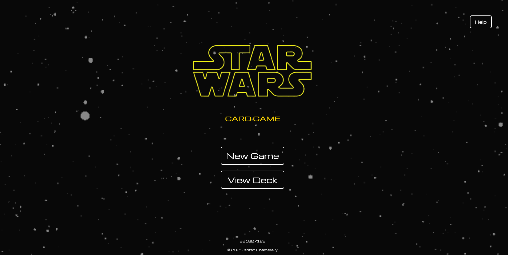

# Star Wars High Card Draw Game



The goal of the game is to draw a card with a **higher** value than your opponent.

## Rules of the game:

1. Cards are drawn sequentially from the deck.
2. You may draw up to *five* cards.
3. On the final draw, the card is automatically assigned to you.
4. The selected card is then placed onto the War Zone to end the your turn.
5. After your opponent completes their selection, the battle phase begins.
6. Both cards are revealed simultaneously.
7. The player with the higher-value card *wins*.
8. If both cards have the same value, the round ends in a tie.

## Dependencies

App was built on node using express.js.

- `axios`           : get request to external [APIs](#apis).
- `ejs`             : templating engine
- `express-session` : session management
- `nodemon`         : backend development

## How to run?

Install dependencies

```bash
npm install
```

Run application

```bash
npm start
```

## APIs

Two external APIs were used for this project.

- [swapi](https://swapi.dev/documentation) : Used for data about the different characters of the Star Wars universe.
- [akabab/starwars-api](https://github.com/akabab/starwars-api) : Mainly used for retrieving character images as the swapi api does not provide.